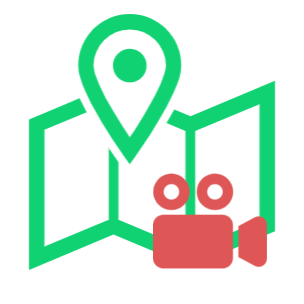

# ゆーちーず カメラ(YOU CHEEZE CAMERA)
`ゆーちーずカメラ`は`ゆーちーずサービス`専用のAndroid向け動画撮影カメラアプリです。

### 1. ゆーちーず とは
`ゆーちーず`はYouTubeの動画再生と地図上のポイントが連動する新しいサービスです。  

`ゆーちーずカメラ`で撮影、YouTubeに投稿した映像を [ゆーちーず Web サイト](https://youcheeze.net/) にアップロードするだけ。

`ゆーちーず`が動画と地図が連動するスクリプトを自動生成！

あなたのブログやホームページにスクリプト張り付けるだけで、動画と地図が連動する`ゆーちーずサービス`が体験できます。

### 2. ビルド
`ゆーちーずカメラ`は`Android Studio Arctic Fox 2020.3.1`以降でビルドできます。

Android Studioについては https://developer.android.com/studio/ でご確認ください。

### 3. ライセンス
`ゆーちーずカメラ`のソースコードは`GPL V3.0`に基づいてライセンスされます。

https://github.com/microgear-public/YouCheezeCamera/blob/master/LICENSE

### 4. 著作権
`ゆーちーずカメラ`はシステムライブラリ/外部ライブラリを除くソースコードについて、株式会社マイクロギアが著作権を保有します。

また、`ゆーちーず`は 2022年3月1日 現在において、経済産業省 特許庁に特許を出願中です。
